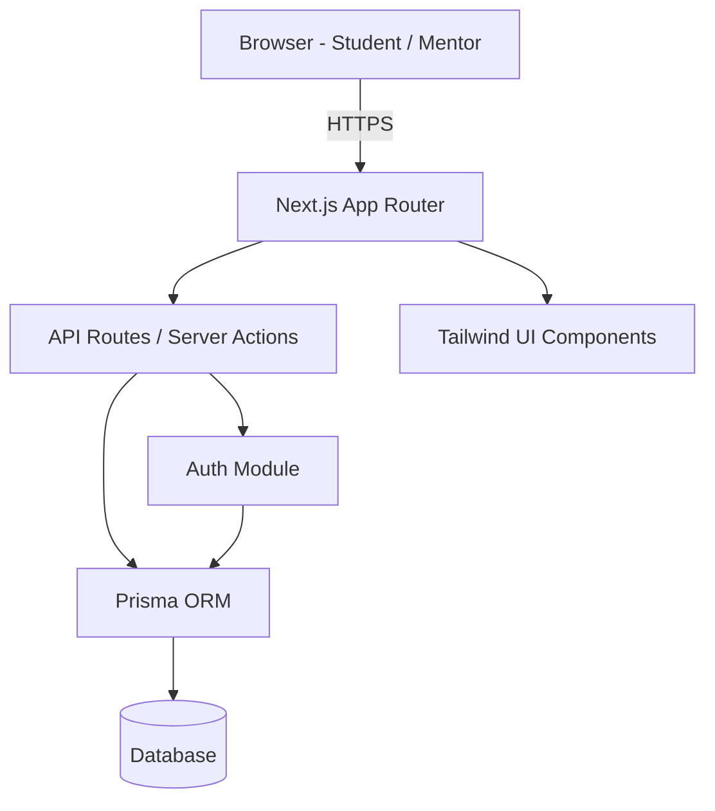
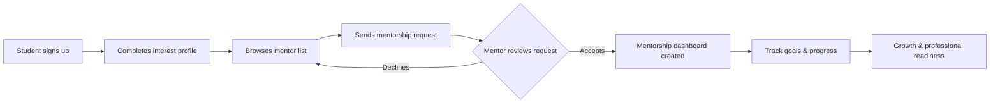

<div align="center">

# 🎓 Ashesi Mentorship Platform

**Bridging the gap between mentors and mentees — built to make student growth and professional readiness easier to find.**


</div>

---

## Overview

Finding a mentor as a student is hard. Finding one who actually matches your interests and takes real responsibility for your growth is harder. **Ashesi Mentorship Platform** exists to close that gap — connecting students with mentors in a structured, trackable way that supports real professional development, not just a one-off introduction.

Built as a team project at Ashesi University.

---

## Demo

<!--
  Add a GIF or screen recording of the app in action below.
  Recommended: keep it under ~10MB so it loads fast in the README.
  Tools: ScreenToGif (Windows), Kap (Mac), peek (Linux), or screenstudio.com
-->

<div align="center">
  
</div>

> *Demo GIF coming soon — drop your recording in `/docs/demo.gif` and it'll render here.*

---

##  Features

- 🔍 **Mentor discovery** — students browse and filter mentors by interest area
- 🤝 **Mentorship requests** — students request mentors; mentors accept or decline
- 📊 **Dashboards** — separate views for mentors and mentees to track progress
- 🎯 **Goal tracking** — structured growth and professional-readiness milestones
- 🔐 **Authentication** — secure student/mentor account system
- ✅ **Tested core flows** — covered with Vitest

---

## 🧱 Tech Stack

<p align="center">
  
</p>

| Layer | Technology |
|---|---|
| Framework | Next.js (App Router) |
| Language | TypeScript |
| Styling | Tailwind CSS |
| ORM | Prisma |
| Testing | Vitest |
| Linting | ESLint |

---

##  Architecture



---

## 🔄 How It Works



---

## 📁 Project Structure

```
ashesi-mentorship-platform/
├── app/                      # Next.js App Router — pages, layouts, routes
├── prisma/                   # Prisma schema & migrations
├── tests/                    # Unit & integration tests (Vitest)
├── DASHBOARD_DESIGN_GUIDES/  # Design references for dashboard UI
├── DESIGN.txt                # Design notes
├── FEATURES.txt              # Feature specifications
├── instructions.txt          # Dev setup / workflow notes
├── app_structure.svg         # Visual app structure diagram
├── declarations.d.ts         # Custom TypeScript type declarations
├── env.ts                    # Environment variable schema/validation
├── next.config.ts
├── tailwind.config.ts
├── tsconfig.json
├── vitest.config.ts
└── package.json
```

---

##  Getting Started

### Prerequisites

- Node.js (v18 or later recommended)
- npm
- A database instance compatible with your Prisma schema (e.g. PostgreSQL)

### Installation

```bash
# 1. Clone the repository
git clone https://github.com/Logic-gate-sys/ashesi-mentorship-platform.git
cd ashesi-mentorship-platform

# 2. Install dependencies
npm install

# 3. Set up environment variables
cp .env.example .env
# Fill in the required values — see env.ts for the expected schema

# 4. Generate the Prisma client & run migrations
npx prisma generate
npx prisma migrate dev

# 5. Start the development server
npm run dev
```

The app should now be running at [http://localhost:3000](http://localhost:3000).

> ⚠️ If there's no `.env.example` yet, consider adding one — it makes onboarding new contributors much faster.

---

## 🧪 Running Tests

```bash
npm run test
```

Tests live in the `tests/` directory and are run with **Vitest**.

---

## 🤝 Contributing

1. Fork the repository
2. Create a feature branch (`git checkout -b feature/your-feature-name`)
3. Commit your changes (`git commit -m "Add: your feature"`)
4. Push to your branch (`git push origin feature/your-feature-name`)
5. Open a Pull Request

Please keep PRs focused and add/update tests for any new functionality.

---

## 👥 Team

Built by students at **Ashesi University**.

<!-- Add your teammates below, e.g.:
- [Your Name](https://github.com/your-username) — Backend & Prisma
- [Teammate Name](https://github.com/their-username) — Frontend & Dashboard UI
-->

See the [contributors page](https://github.com/Logic-gate-sys/ashesi-mentorship-platform/graphs/contributors) for the full list.

---

## 📄 License

<!-- Add a LICENSE file to the repo and update this section to match -->
This project is licensed under the MIT License — see the [LICENSE](./LICENSE) file for details.

---

<div align="center">

*Made with care by students who know firsthand how hard it is to find the right mentor.*

</div>
